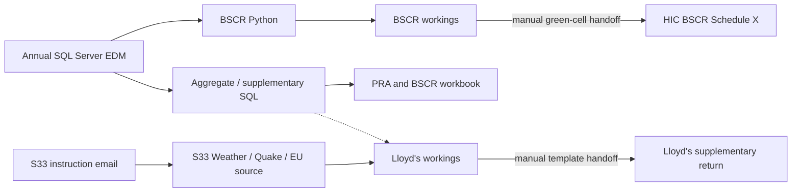

# Regulatory returns

## Data sources

- Annual GC-format SQL Server EDMs selected for each return.
- Received S33 exposure workbook and its 22 January 2026 instruction email.
- Checked-in BSCR, PRA, and Lloyd's calculation/return workbooks.
- `RMS_USERCONFIG.dbo.currfx`, `RMS_GEOGRAPHY.dbo.country`, embedded lookup tabs, and manually maintained scale factors where used.
- Current regulator instructions, approved templates, mappings, and cycle decisions held outside this repository.

The [complete data-flow map](data-flow.md) is the canonical inventory and calculation-lineage reference. It distinguishes direct links, structural schema matches, manual handoffs, and unresolved provenance.

## Return catalogue

| Return | Repository implementation | Checked-in artefacts | Detailed guide |
|---|---|---|---|
| Lloyd's supplementary information | Received S33 source, SQL extracts, and calculation workbooks for RoW, California, South Africa, and EU CRESTA | Source workbook/email and four workings are present; final approved submission template remains external | [Lloyd's supplementary](lloyds-supplementary.md) |
| BSCR Schedule X | Python/Polars SQL-to-CSV extraction, BSCR pivot workings, and HIC return workbook | Script, workings, and Schedules X(a), X(b), X(c), X(f) are present | [BSCR](bscr.md) |
| PRA and combined BSCR aggregates | Embedded SQL, mappings, raw data, formula tables, pivots, and BSCR calculation panels | Combined PRA/BSCR workbook is present twice identically; final PRA template remains external | [PRA](pra.md) |

## Shared flow

Dotted linkage means the checked-in SQL structurally fits workbook data tabs but the exact population run is not recorded.

## Source-of-truth order

When instructions disagree, use:

1. current regulator instructions and current return template;
2. approved reporting-cycle decisions, mappings, rates, and workbooks;
3. current reviewed repository scripts and SQL;
4. historical notes under `docs/archive/`.

Checked-in values and formulas are evidence of a specific process state, not standing regulatory definitions.

## Standard controlled workflow

1. Freeze the current template, instructions, reporting date, entity/portfolio scope, source workbook versions, and EDM database.
2. Review hard-coded database, peril, policy type, geography, retention, FX, scale-factor, and mapping assumptions.
3. Record the exact query/script and row counts used to populate each workbook data tab.
4. Reconcile source totals before formulas and pivots.
5. Refresh only the intended tables/pivots and record their source ranges.
6. Reconcile gross/net, currency, units, entity, geography, and as-of date through every handoff.
7. Populate only approved green/input cells; preserve template formulas, validation, and structure.
8. Complete [controls and evidence](controls.md), including preparer/reviewer records.
9. Archive the exact source, code, output, workbook, reconciliation, and final submission used.

## Known cross-process risks

The current artefacts contain conflicting FX and `_SRP` retention factors, different geography lists, stale as-of dates, duplicate copies, incomplete SQL producers, stale external links, and manual green-cell handoffs. The [data-flow discrepancy register](data-flow.md#known-mismatches-and-unresolved-controls) lists each issue and is required reading before use.

## Documentation map

- [Complete data-flow map](data-flow.md)
- [Lloyd's supplementary information](lloyds-supplementary.md)
- [BSCR Schedule X](bscr.md)
- [PRA and combined BSCR aggregates](pra.md)
- [Controls and evidence](controls.md)

Historical and duplicate process notes are retained under [`docs/archive/`](../archive/) and are not current operating instructions.
