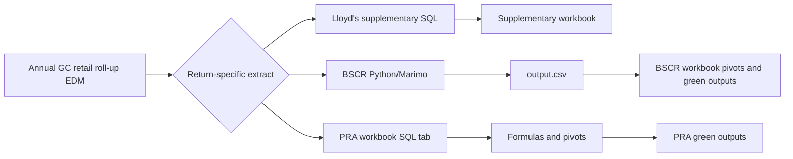

# Regulatory returns

This section separates regulatory-return work from the repository's supporting
aggregation and exposure-reporting utilities. It records what is present, what
is missing, and which controls must be completed before figures are used in a
submission.

## Return catalogue

| Return | Repository implementation | Artifact status | Detailed guide |
| --- | --- | --- | --- |
| Lloyd's supplementary returns | T-SQL extracts for Rest of World, South Africa and California | SQL is present; run it directly against the annual SQL Server EDM. The final supplementary workbook is not present. | [Lloyd's supplementary returns](lloyds-supplementary.md) |
| BSCR Schedule V | Marimo/Python transformation over a SQL Server EDM extract | Script and historical notes are present. No Excel workbook is present in the current tree or reachable Git history. | [BSCR Schedule V](bscr.md) |
| PRA January/February return | Historical notes for an Excel-led workflow | Not reproducible here: the expected workbook and `Region_mappings` lookup are absent from the current tree and reachable Git history. | [PRA return](pra.md) |

The spreadsheet check covered `.xlsx`, `.xlsm`, `.xls`, `.xlsb` and `.ods`
files in the working tree, including ignored files, and all reachable Git
history. No matches were found. The notes describe spreadsheet formulas,
pivots and final green tabs, but those artifacts cannot be inspected or
confirmed from this repository.

## Supporting material, not classified here as a return

| Material | Role |
| --- | --- |
| [`aggregates/aggs-from-edm.sql`](../../aggregates/aggs-from-edm.sql) | Generic, EDM-specific aggregation query used as supporting analysis and as the historical basis for BSCR/PRA work. |
| [`globalexposures/`](../../globalexposures/) | Event-footprint exposure report with its own Python workflow; it is not one of the supplementary-return SQL extracts. |
| Root-level `main.py` | Package placeholder; it does not run a regulatory return. |

## Shared data flow

The workbook stages shown above are described by the historical notes or the
user-provided process. Their files are not in this repository. Recover the
approved workbooks before attempting the final BSCR or PRA return stage.

## Source-of-truth order

When instructions disagree, use:

1. current regulator instructions and current return template;
2. approved reporting-cycle decisions, mappings and workbooks;
3. current, reviewed repository scripts;
4. historical notes in this repository.

The scripts contain hard-coded 2026 database names, entity filters, peril codes
and retention factors. They are evidence of the 2026 process, not standing
regulatory definitions.

## Standard annual workflow

1. Obtain the current return template, instructions, reporting date and entity
   scope.
2. Record the exact EDM database/version and confirm its schema matches the
   script's expected GC 2026 layout.
3. Review every hard-coded item: database, `PERIL`, `POLICYTYPE`, portfolios,
   geography, currency table and Fine Art retention.
4. Run a pre-aggregation row-count and join-cardinality review.
5. Execute the return-specific process.
6. Reconcile gross/net totals, currencies, entity totals and geography totals
   before copying results into a workbook.
7. Complete the evidence record in [Controls and evidence](controls.md).
8. Obtain review of both the extract and final template; archive the exact
   script, output, workbook and reconciliation used.

## Documentation map

- [Lloyd's supplementary returns](lloyds-supplementary.md): SQL inventory,
  calculation analysis and direct SQL Server runbook.
- [BSCR Schedule V](bscr.md): Python/Marimo workflow, spreadsheet handoff and
  known limitations.
- [PRA return](pra.md): recoverable workflow, spreadsheet logic and missing
  dependencies.
- [Controls and evidence](controls.md): reusable execution and review checklist.
